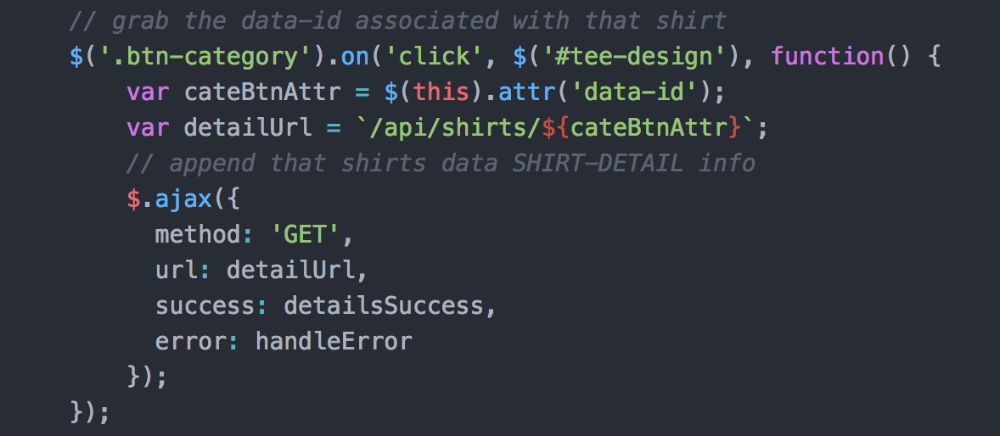

App Name: Shop.ly            

We created an online store called Shop.ly.  On this website users can browse and purchase t-shirts. A backend database was also created to track the inventory and users.

https://shirt-ly.herokuapp.com/

https://github.com/oxleberry/Shop.ly

Technologies Used
Technologies used to create this website include:
•	HTML
•	CSS
•	JavaScript
•	jQuery
•	JSON/AJAX
•	Bootstrap
•	MongoDB
•	Express

Existing Features
Our site has the following features:
•	Navigation Bar
•	Carousel
•	User Order Form
•	Shopping Cart
•	Responsive Layout

Planned Features
As we continue to work on the site we will add the following:
•	Ability to capture and retain each purchase of a user
•	Display a confirmation/purchase ID to user upon successful checkout
•	User address validation
•	Capture payment information or route users to purchase t-shirts via PayPal or Stripe

Creating Shop.ly

Index.html:
•	Link Bootstrap, Google Fonts, Font Awesome and personal CSS  
•	Add Navigation Bar  
•	Add three Bootstrap carousels to main Index.html
•	Clicking on an image in the carousel will take user to the Category section on the index page
•	Category section will display 9 t-shirts in a card style layout (3 rows and 3 columns).
•	Clicking on an image in the category section will take user to Show section where the t-shirt image is enlarged and displays the following text: t-shirt name, price, available sizes, t-shirt description and Add to Bag button.
•	In the Show section, the user can select one of the enabled Size button(s) (small, medium, large, etc.).
•	Upon clicking the Add to Bag button, the user will arrive at the Cart section of the page.
•	Shopping Cart section displays an image for each item the user added to the bag and includes the t-shirt name, price, quantity and shirt description. There is a “Remove” button displayed for each item in the shopping cart.  
•	Cart section includes a user form and shopping cart details.
•	On the form the user can enter name, number, email address, and physical address to ship the product.  There are two buttons on form side of screen, “Continue Shopping” and “Checkout.”
•	Add social media icons to footer

CSS Styles file:
•	Use semantic HTML and CSS to create Shop.ly website.
•	Use the appropriate Google Fonts to style the text on the page.
•	Add a media query to update the layout and styles for a responsive design.

Triumphs:
•	Befriending Bootstrap for Riki – utilizing Google for guidance
•	Conquering MongoDB for Sharon
• Decrementing inventory upon checkout/purchase

Challenges:
•	GitHub
  o	1st time working on GitHub with a peer
  o	Forking, Pairing, Merging and Collaborating
  o	Understanding the Controllers role
• Understanding MongoDB

### Code Samples
#### Button Association Code
* Linking data about a shirt using button attributes as a way to track the user's process through an order

